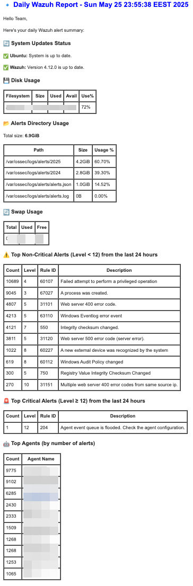
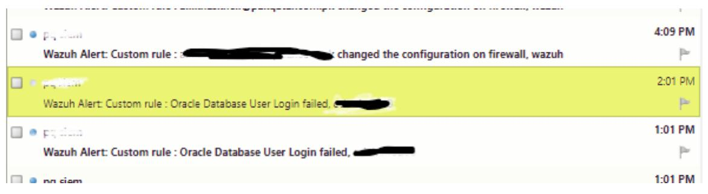

# Wazuh Reports

## Wazuh Agents Report

These Python scripts automate the process of extracting agent data from the Wazuh API (light version, only save in csv file full information about agents: [`wazuh_agents_csv_report.py`](./wazuh_agents_csv_report.py)), filtering and reordering specific columns, and then uploading this data as a neatly formatted Google Sheet to your Google Drive ([`wazuh_agents_google_report.py`](./wazuh_agents_google_report.py)). It uses a Service Account for secure and hands-free authentication, making it ideal for scheduled tasks or server-side operations.

### Features:
- ⚙️ Wazuh API Integration: Fetches a list of active agents from your Wazuh manager.
- 🛠️ Customizable Columns: Selects and reorders specific agent fields to include in your report.
- 📝 Column Renaming: Allows you to define user-friendly names for your columns in the Google Sheet, independent of the original Wazuh API field names.
- 💻 Google Sheets Conversion: Automatically converts the extracted CSV data into a native Google Sheet format.
- 📐 Automated Column Resizing: Adjusts column widths in the Google Sheet to fit content for improved readability.
- 🔐 Service Account Authentication: Securely connects to Google Drive and Google Sheets APIs without manual user intervention.
- 💾 Existing File Update: Updates an existing Google Sheet if found, preventing duplicate files.
- ✂️ Temporary File Cleanup: Automatically removes the temporary CSV file after successful upload.

### Requirements:
- Python 3.x installed. Required Python libraries (can install them using `pip`: `pip3 install requests google-api-python-client google-auth-httplib2 google-auth-oauthlib`):
    - `requests`
    - `google-api-python-client`
    - `google-auth-httplib2`
    - `google-auth-oauthlib`
- Wazuh API Access:
    - Your Wazuh manager should be running and accessible from where you run the script.
    - You need valid Wazuh API credentials (username and password).
- Google Cloud Project & Service Account:
    - A Google Cloud Project.
    - Google Drive API and Google Sheets API enabled in your Google Cloud Project. Go to [`Google Cloud Console`](https://console.cloud.google.com/) --> `APIs & Services` --> `Enabled APIs & Services`. Search for and enable both APIs.
    - A Service Account with a generated JSON key file.
        - In Google Cloud Console, navigate to `APIs & Services` --> `Credentials`.
        - Click `CREATE CREDENTIALS` --> `Service Account`.
        - Follow the prompts to create the service account.
        - After creation, click on the service account name, go to the Keys tab, click `ADD KEY` --> `Create new key`, and choose `JSON`.
        - Download the `JSON` file and rename it to `credentials.json` (or remember its name if you choose differently). Place this file in the same directory as your Python script.
    - Share your Google Drive Folder with the Service Account.
        - Open your Google Drive (`drive.google.com`).
        - Create or select the folder where you want to upload the Google Sheet.
        - Right-click the folder, select `Share`.
        - In the `People` or `Add people and groups` field, enter the email address of your `Service Account`. You can find this email in the `client_email` field of your `credentials.json` file.
        - Grant the Service Account `Editor` permission.

### Installation & Configuration

1. Open the `wazuh_agents_csv_report.py` or `wazuh_agents_google_report.py` script and modify the following sections:
- `WAZUH_PROTOCOL`;
- `WAZUH_HOST`;
- `WAZUH_PORT`;
- `WAZUH_USER`;
- `WAZUH_PASSWORD`;
- `WAZUH_LOGIN_ENDPOINT`.

2. Open the `wazuh_agents_google_report.py` script and update the `SERVICE_ACCOUNT_FILE`, `FOLDER_ID`, and desired file names.

3. Modify the `WAZUH_DESIRED_COLUMNS` list to specify which columns you want to include in your Google Sheet and in what order. To rename a column, use a tuple (`original_api_key, "New Column Name"`). If you don't want to rename a column, just list its original API key as a string.

4. How to Run:
- Save the script (e.g., as `wazuh_agents_google_report.py`).
- Place your `credentisal.json` file in the same directory as the script.
- Run the script from your terminal:

```shell
$ python3 wazuh_agents_google_report.py
```
The script will connect to your Wazuh API, fetch the data, process it, upload it to your Google Drive folder as a Google Sheet, and automatically adjust the column widths.

Scheduled execution (via crontab):

```shell
$ crontab -e

# Run daily at 11:50 PM
50 23 * * *     /usr/bin/python3 /usr/local/wazuh-reports/wazuh_agents_google_report.py >/dev/null 2>&1
```

---

## Wazuh Alerts Report

Bash script that sends a daily report email to Wazuh admins, providing an overview of server and alert statistics.

### Features:
- 🛠️ Extracts alerts from Wazuh logs (`alerts.json`).
- 🚨 Filters alerts by severity level (configurable).
- 💾 Includes system information (disk & swap usage).
- 📩 Sends an HTML-formatted report via email.
- 🥷 Easy installation via installer script or in manual mode.

### Requirements:
- Running Wazuh instance.
- `jq` and `mailutils`.
- A working mail server (e.g., postfix).

### Installation & Configuration

Run the installer:
```shell
$ wget https://raw.githubusercontent.com/kraloveckey/wazuh-reports/main/wazuh_alerts_report_install.sh
$ bash wazuh_alerts_report_install.sh
```

The installer will:
- Install necessary dependencies (`jq`, `mailutils`).
- Clone the repository to `/usr/local/wazuh-reports`.
- Set up a cron job to run the report daily at midnight.
- Ensure correct file permissions.

To customize the script, modify the variables of `.wazuh_alerts_report.conf`:

```shell
LEVEL=12                      # Minimum severity level for critical alerts
TIME_PERIOD="24 hours"        # Time range for logs
TOP_ALERTS_COUNT=10           # Number of top alerts to display

MAIL_TO="MAIL_TO@dns.com"     # Change to recipient email
MAIL_FROM="MAIL_FROM@dns.com" # Change to sender email
```

To test the script manually, run:

```shell
/usr/local/wazuh-reports/wazuh_alerts_report.sh
```

Scheduled execution (via crontab):

```shell
$ crontab -e

# Run daily at 12:05 AM
05 00 * * *     /bin/bash /usr/local/wazuh-reports/wazuh_alerts_report.sh >/dev/null 2>&1
```

Check for errors:

```shell
$ cat /var/ossec/logs/alerts/jq_errors.log
```

### Updating & Uninstalling

Update to the latest version:

```shell
$ cd /usr/local/wazuh-reports/
$ git pull
```

Remove the script:

```shell
$ rm -rf /usr/local/wazuh-reports/
$ sed -i '/wazuh_alerts_report.sh/d' /etc/crontab
```

### Example of Report


---

## Wazuh Custom Email Alert

Integrations are extensions that can be executed on the Wazuh manager in response to a event and use information from that event.

[`custom-email-alerts`](./custom-email-alerts) integration allows the user to send fully customizable email alerts for events observed by the Wazuh manager. This was created to overcome the limitations of the hard coded mail daemon built into Wazuh.

Give read and write access to [`custom-email-alerts`](./custom-email-alerts) file, and change smtp nameserver and email from configuration in the script:

```shell
root@wazuh:/var/ossec/integrations# chmod 750 custom-email-alerts
root@wazuh:/var/ossec/integrations# chown root:wazuh custom-email-alerts
root@wazuh:/var/ossec/integrations# nano custom-email-alerts
```

Move to `ossec.conf` file of Wazuh Server. Add these lines in Wazuh configuration file:

```shell
$ nano /var/ossec/etc/ossec.conf

...
  <!--Custom Email Alerts-->
  <integration>
      <name>custom-email-alerts</name>
      <hook_url>MAIL_TO@dns.com</hook_url>
      <rule_id> 12031, 1214, 42422</rule_id>
      <alert_format>json</alert_format>
  </integration>
...
```

The `hook_url` must be the to address to whom the mail must be send with the following `rule_id` or `level` (`<level>8</level>`). The `rule_id` tag will consist of the rule ids need to send to that email in `<hook_url>`.

Also, you can do the same procedure for different emails to achieve custom email alerts based on rule description. Also by using the above lines, you can send email alerts to different users on the basis of `rule_id` or `level` or on the basis of following [`url`](https://documentation.wazuh.com/current/user-manual/manager/manual-email-report/index.html#granular-emailoptions). For example, by using the following tags:

```shell
<level>8</level>
<rule_id>120231</rule_id>
```

You can change these setting according to needs. Now save and restart the Wazuh Manager, and will get the mail alerts generated.



---

<a href="https://www.paypal.com/donate/?hosted_button_id=GWWLEXEF3XL92">
  
</a>
